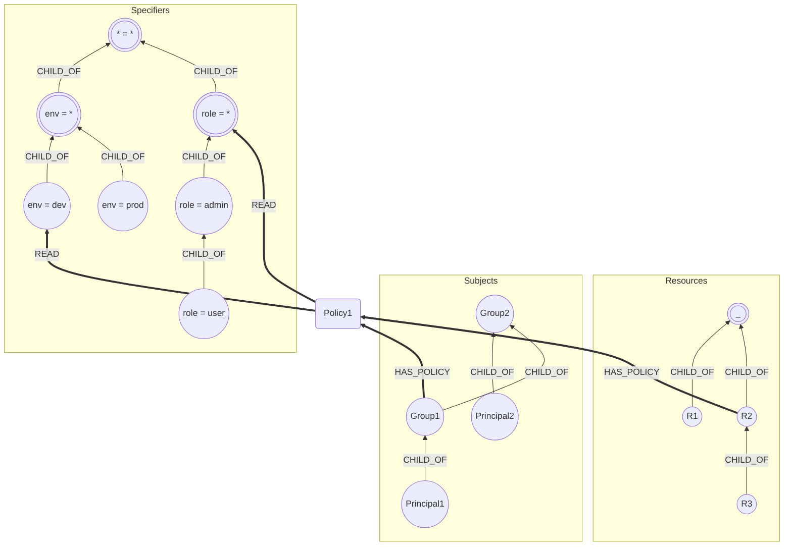

# otter: graph-based authorization

## Basic Concepts



### Subject
Representation of a user/group of users. Represents the `Who`.\
`(:Subject {name: "<unique-id>", type: "<Principal | Group>"})`

Connected to other subjects using a hierarchy.\
`(child)-[:CHILD_OF]->(parent)`

**Assumptions**:
- Principals can only be children of Groups, not other Principals.

### Resource
Object that needs to be authorized. Represents the `What`\
`(:Resource {name: "<unique-id>"})`

Connected to other resources using a hierarchy.\
`(child)-[:CHILD_OF]->(parent)`

**Assumptions**:
- Root resource has `name: "_"`. Does not have any parents.

### Specifier
Defines additional properties for the permission.\
More extensible version of adding the properties to the graph edge.\
`(:Specifier {key: "<key>", value: "<value"})`

Connected to other specifiers using a hierarchy.\
`(child)-[:CHILD_OF]->(parent)`


**Assumptions**:
- Root specifier has `key: "*", value: "*"`.
- Immediate children have `key: "<key>", value: "*"`.

### Action
`How` a particular `Subject` can access a `Resource`.\
Represented in the graph as the edge type between a `Policy` and `Specifier` node.

### Policy
Intermediate node to represent a permission. Needed since the subject and resource are to be used as one group.\
`(:Policy {id: "<uuid>"})`

Policies are represented as:
```
(policy:Policy {id: "<uuid>"})
(subject:Subject)-[:HAS_POLICY]->(policy)
(resource:Resource)-[:HAS_POLICY]->(policy)
(policy)-[:<action>]->(specifier:Specifier)
```

## Querying
### Can
`Can <Subject> perform <Action> on <Resource> with <Specifiers>?`\
Yes/No question, returns a boolean.

Give all details, check if there is a path.

### WhatCan
`WhatCan <Subject> perform <Action> on with <Specifiers> [under <Parent Resource>]?`\
List of resources, bounded by the optional parent resource in the hierarchy.

Fetch resources given everything else.

### WhoCan
`WhoCan <Action> on <Resource> with <Specifiers>?`\
List of subjects.

Fetch subjects given everything else.

### HowCan
`HowCan <Subject> perform <Action> on <Resource> [with <Specifiers>]?`\
Fetch specifiers given everything else. Optionally provide specifiers to reduce output space.

This is a heavy query since it returns a cartesian product of all applicable specifiers.